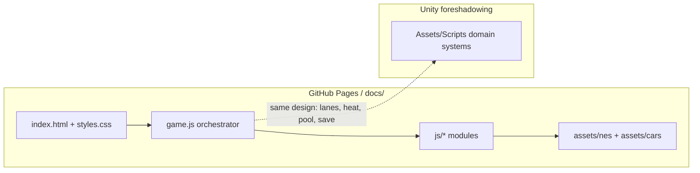

# Endless Chase

Mobile-first **8-bit getaway endless runner**: weave through traffic, outrun the heat, and jump biomes before the cops close in. Built for phone browsers (WebGL + touch), with Unity C# systems ready for a later native/iOS port.

**Live demo:** [lakshmanchelliah.github.io/EndlessChase](https://lakshmanchelliah.github.io/EndlessChase/)

## Features

- **Biome lanes** — City (4 lanes, 2 opposing), rural (2-way), highway (2 one-way); prompted turns via on-ramps
- **Risk / reward** — Red-light NOS + cross traffic, heat/pursuit busts, curb-lane gas stations (hold-to-fill while cops approach)
- **Garage meta** — Coins, car unlocks, per-car upgrades persisted in `localStorage`
- **High score** — Best distance run saved and shown on menu, HUD, and game over
- **NES presentation** — 320×180 nearest-neighbor upscale, CRT scanlines, procedural CC0 pixel textures, Press Start 2P UI
- **Touch-safe WebGL** — Swipe steering (inverted), sticky brake, no pull-to-refresh / page scroll on the canvas

## Tech stack

| Layer | Choice |
|-------|--------|
| Playable client | Vanilla ES modules + [Three.js](https://threejs.org/) 0.160 (CDN import map) |
| Hosting | GitHub Pages (`docs/` as site root) |
| Audio | Web Audio API (procedural siren) |
| Persistence | `localStorage` (`EndlessChase.Save.v1`) |
| Tests | Playwright smoke (`tests/smoke.mjs`) |
| Future port | Unity 2022.3 LTS C# (`Assets/Scripts/`) — not required to play |

## Architecture



**Client flow:** `index.html` boots `game.js` → loads save / vehicles → menu → run loop (input → worldgen segments → pooled traffic → heat/gas/UI). Debug handle: `window.__endlessChase`.

## Project structure

```
├── docs/                 # Playable NES WebGL client (GitHub Pages root)
│   ├── index.html        # Shell, HUD panels, Three import map
│   ├── game.js           # Bootstrap + run loop / systems glue
│   ├── styles.css        # CRT / NES UI
│   ├── js/               # constants, worldgen, nes meshes, pool, save, siren…
│   └── assets/           # nes/ textures + cars/ GLBs & previews
├── design/               # Art bible, prompts, WebGL notes, QA checklist
├── Assets/               # Unity project (Scripts, Shaders, WebGL template)
│   └── ThirdParty/       # CC0 lowpoly car pack (reference / future Unity)
├── ProjectSettings/      # Unity version pin
├── scripts/              # Texture atlas generator
├── tests/                # Playwright smoke test
├── package.json
└── AGENTS.md             # Cloud agent / contributor runbook
```

## Quick start

```bash
npm install
npx playwright install chromium   # once, for smoke tests
npm run serve                     # http://localhost:4173
```

Open **http://localhost:4173** — swipe or A/D to change lanes (inverted); swipe down / S to brake; swipe up / W / Space to resume.

Optional: regenerate NES PNGs with `npm i pngjs && npm run textures`.

## Testing / CI

```bash
npm run serve          # terminal 1
npm run smoke          # terminal 2 — expects SMOKE_OK
npm run smoke:live     # same checks against the deployed Pages URL
```

Manual QA: [design/UITestChecklist.md](design/UITestChecklist.md).

## Engineering highlights

1. **Seeded worldgen** — Segment kinds hash off tile index (`worldgen.js`) so the road feels random but stays structured and reproducible.
2. **Pool hygiene** — Traffic cars clear role flags on return (`carPool.js`) so recycled chase/gas/deco vehicles never stay frozen or uncollidable.
3. **Mobile input contract** — Swipes fire on distance (no max-duration gate); touch/mouse guard avoids ghost clicks; inverted lane mapping matches thumb-friendly steering.
4. **Heat-gated audio** — Siren unlocks inside the Play gesture (iOS requirement), then volume tracks the police-proximity bar after an opening cue.
5. **Dual-stack foreshadowing** — Browser client ships today; Unity scripts mirror lane/pool/risk/save domains for a later iOS WebGL→native path.

## Controls (short)

| Input | Action |
|-------|--------|
| Swipe L/R · A/D | Change lanes (inverted) |
| Swipe down · S | Brake (sticky until up) |
| Swipe up · W · Space | Resume / speed up |
| Turn cues | Swipe onto on-ramp to switch biome |
| Gas stations | Outer curb lane → pull in → hold to fill |

## License & disclaimer

- **Code:** All rights reserved unless otherwise noted (`UNLICENSED` in `package.json`). Ask before redistributing.
- **Procedural NES textures:** CC0 — see `docs/assets/nes/ATTRIBUTION.txt`.
- **Lowpoly cars:** CC0 (Cosmo) — see `Assets/ThirdParty/lowpoly_cars_free/License.txt` and `docs/assets/cars/`.
- **Fan / style note:** “NES-like” means a limited 8-bit *aesthetic* (palette, pixels, CRT). Not affiliated with Nintendo; no Nintendo IP or ROM assets are used.
