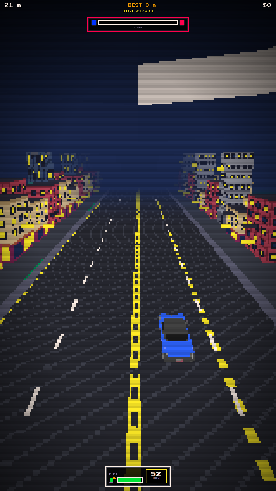
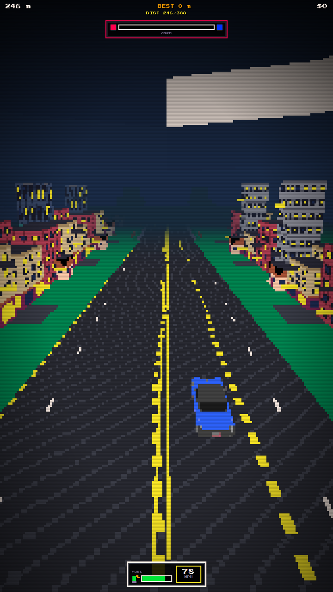

# Biome Transition — UI/UX Test Report

**Build tested:** post–PR #70 polish (`game.js?v=79` → cue glyph fix `v=80`)  
**Harness:** `tests/biome-transition-ux.mjs` (Playwright + `debugClearHazards` / `debugAdvance`)  
**Date:** 2026-07-16  
**Playable pairs:** city ↔ rural (highway is not offered by `pickTurnBiomes`)  
**Screenshots:** [`design/biome-transition-ux/`](./biome-transition-ux/) · raw report [`report.json`](./biome-transition-ux/report.json)

## Verdict

Transitions are **playable and mostly readable**. Atmosphere and scenery mix soften the corridor without the short-biome / recycle-ahead regressions from the reverted overhaul. Remaining UX debt is mostly **cue clarity** (font glyphs, accept window) and **append-ahead latency** (HUD flash far before the corridor is visible).

Harness summary (city↔rural + natural cue + stretch): **19 pass / 1 warn / 0 fail** before the glyph fix; natural swipe-accept was the only warn.

---

## What the player experiences

| Beat | What happens | Screenshot |
|------|----------------|------------|
| Baseline city | 4 lanes, buildings, dark blue fog | `ux-city-baseline.png` |
| Accept turn / forced switch | Short yellow flash `>> SUBURBS` / `>> CITY` | `ux-city-to-rural-hud-flash.png` |
| Drive until corridor | ~150–180 m of normal road (append-only queue) | — |
| Exit | Destination mix props appear; atmosT ≈ 0.05 | `ux-city-to-rural-exit.png` |
| Taper | Road narrows / widens; outer city lanes close with pylons | `ux-city-to-rural-taper-mid.png` |
| Bad lane | `WRONG WAY` when targeting closed / oncoming | `ux-city-to-rural-lane-warn.png` |
| Enter / arrive | Biome flips; rural houses or city blocks; atmosT ≈ 0.92 | `ux-city-to-rural-enter.png`, `…-arrived.png` |
| Stretch | Next natural turn often **~800–900 m** later | `ux-stretch-end.png` |
| Natural offer | Yellow turn banner with both directions labeled | `ux-natural-turn-cue.png` |






---

## Checklist results

### Atmosphere & environment

| Check | Result | Notes |
|-------|--------|-------|
| Soft fog/sky/ground lerp through corridor | **Pass** | `atmosT` samples 0.05 → ~0.29 (taper) → 0.92 (enter). No hard fog pop on adopt when t ≥ 0.9. |
| Destination scenery foreshadow (mix overlay) | **Pass** | Mix group present on exit + taper (both sides, weight ramps). |
| Hard green berm / asphalt seam | **Warn** | Bright NES green berm still meets asphalt with a sharp edge (see exit/taper shots). Acceptable for palette; still the loudest “seam” players notice. |
| Grey sky quad artifact | **Warn** | Large light-grey rectangle upper-right sky in multiple shots — looks like an untextured sky/cloud plane, not biome-specific. Track separately from corridor blend. |

### Road / lanes / fairness

| Check | Result | Notes |
|-------|--------|-------|
| City→rural outer lanes close progressively | **Pass** | Early taper usable `[1,2,3]` with closed `[-6]`; player not auto-steered. |
| Closed-lane wreck is intentional | **Pass** | Staying in a closing lane can wreck (by design). Harness must `debugSetLane` into remaining forward lanes. |
| `WRONG WAY` readability | **Pass** | Flashes when targeting oncoming / non-usable during taper (`ux-city-to-rural-lane-warn.png`). |
| Rural→city widening | **Pass** | Enter settles to 4 usable lanes; mix shows city blocks on green berm mid-corridor. |
| No recycle-ahead shortening | **Pass** | Corridor appends at `nextSpawnZ`; stretches after settle measured ~884 m to next turn. |

### HUD / cues

| Check | Result | Notes |
|-------|--------|-------|
| Destination flash on transition start | **Pass** | Reuses light HUD for ~1.4s: `>> SUBURBS` / `>> CITY`. |
| Flash vs corridor latency | **Warn** | Flash fires immediately; exit tile often **~170 m ahead**. Players see “going to Suburbs” long before the road changes — can feel like a false alarm. |
| Natural turn banner | **Pass** (after glyph fix) | Was `← SUBURBS · SUBURBS →`; Press Start 2P has **no ←/→**, so arrows rendered as dots (`• SUBURBS • SUBURBS •`). Fixed to `<< … \| … >>`. |
| Same label both sides (city) | **Info** | Both directions offer Suburbs — correct per `pickTurnBiomes`, but the banner looks redundant. |
| Turn accept window | **Warn** | `TURN_WINDOW = 1.25s` is tight; harness swipe often missed after screenshot. Feels snappy / easy to miss on mobile. |
| HUD clutter mid-run | **Info** | Mission toasts (`DIST CLEAR +$…`) can stack under cops bar during arrive — readable but busy. |

### Biome length / pacing

| Check | Result | Notes |
|-------|--------|-------|
| `TURN_COOLDOWN_SEGS = 18` feel | **Pass** | Post-settle gap to next offer ~884 m in harness — biomes feel substantial. |
| Highway in turn graph | **Info** | Not offered; escape hatch only if somehow on highway. |

---

## Severity board

### Fix soon
1. **Turn / flash glyphs** — use ASCII `<<` `>>` (landed in this change set with cache-bust `v=80`).
2. **Turn window** — consider 1.6–2.0s or keep banner until the offer segment is passed (not only 1.25s timer).
3. **Sky grey quad** — investigate sky mesh / untextured plane (visible in nearly every night shot).

### Polish later
4. Soften berm–asphalt edge one notch without reintroducing neon taperGround / recycle-ahead.
5. Optional: stagger left/right turn destinations when both currently map to the same biome, or shorten copy to `<< SUBURBS >>` when identical.
6. Optional: delay destination flash until exit is within ~40 m, or show a second “approaching” ping.

### Do not regress
- No recycling all ahead segments on transition start.
- No auto-steer into surviving lanes.
- Keep append-only corridor + atmos lerp + dual-side mix.

---

## How to re-test

```bash
npm run serve          # already on :4173 in cloud
npm run biome-ux       # writes /opt/cursor/artifacts/biome-ux/
```

Manual (live or local):

1. Play → city stretch → watch for yellow `<< SUBURBS | SUBURBS >>`.
2. Swipe toward a side within the window; confirm `>> SUBURBS` flash and later green mix / lane close.
3. Survive taper in a forward lane; confirm arrive in suburbs without fog pop.
4. Drive ~800 m+; confirm biome still feels long before the next offer.
5. Reverse: suburbs → `<< CITY | CITY >>` → widening back to four lanes.

Also covered lightly in [`UITestChecklist.md`](./UITestChecklist.md).
